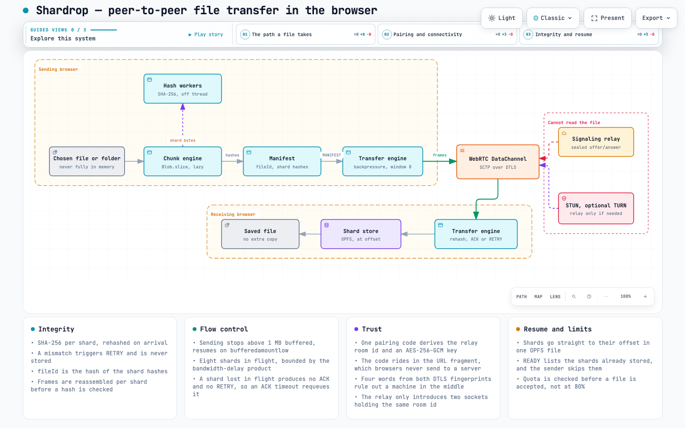

# Shardrop

Chunked, verified, resumable file transfer directly between two browsers. The file is split, hashed and streamed over a WebRTC DataChannel; no server ever receives it.

```text
File → chunk → hash → manifest → frames → DataChannel → verify → store → reassemble
```

**[Read the case study](docs/case-study.md)** for the design and the trade-offs.

[](docs/architecture.html)

The diagrams are interactive and self-contained: open
[architecture.html](docs/architecture.html) or
[protocol-sequence.html](docs/protocol-sequence.html) in a browser for guided
views, tracing and export.

## What it does

- **Chunks a file without loading it into memory.** `Blob.slice()` and a generator, so a multi-gigabyte file streams with flat memory use.
- **Verifies every chunk.** SHA-256 per chunk, checked on arrival. A chunk that fails is re-requested, never stored.
- **Respects backpressure.** The sender stops while the DataChannel has more than 1 MB queued and waits for `bufferedamountlow`, with at most 8 chunks in flight. Without this, a large file kills the tab.
- **Resumes.** Chunks are written to their offset in an OPFS file and which ones arrived is persisted, so an interrupted transfer continues instead of restarting.
- **Recovers from loss and corruption.** A corrupted chunk triggers RETRY; a chunk lost entirely is caught by an ACK timeout, since nothing else would ever report it.
- **Never trusts the wire.** Indexes outside the manifest, over-long chunks and data arriving before a manifest are all rejected.
- **Shows the shards.** The progress display is a mosaic with one tile per shard: tiles turn green as each hash checks out, amber when one had to be resent.
- **Sends folders.** Pick several files or a whole folder; paths are kept, and each file keeps its own manifest, verification and resume state.
- **Says how it connected.** Direct or through a TURN relay, always labelled, and a refused network is explained rather than left spinning.
- **Proves who you are connected to.** Both devices show four words derived from the two DTLS certificates. If they match, nothing is sitting in the middle of the connection.
- **Continues where it stopped.** Shards already stored are reported at the start of a transfer and skipped, and the UI says so.
- **Checks storage first.** A transfer too large for the browser's quota is refused up front, with the reason sent back, instead of dying at 80%.

## Run it

```sh
npm install
npm run dev        # web app on :5173 and signaling relay on :8787
npm test           # 86 unit tests (fake wire, no browser)
npm run test:e2e   # 6 Playwright tests: two real tabs, real WebRTC
npm run typecheck
npm run lint
```

The e2e suite starts its own dev server and relay, pairs two browser contexts
both ways (shared link and typed code), transfers a file and a folder, and
checks every downloaded file's SHA-256 against the source.

**Pairing:** press **Create a code**, then open the link (or scan the QR code,
or type the code) on the other device. The two browsers connect themselves.
Then drop in files, or choose a folder, and press **Send**.

**Manual mode** is still there, collapsed under the pairing panel: copy the
offer and answer by hand and no server is involved at all, at the cost of
working only on one network.

## How it fits together

```text
src/core/          no DOM, all testable
  chunker.ts       File → lazy chunks
  hasher.ts        SHA-256 → hex
  manifest.ts      what is being sent; transferId + content-derived fileId
  frame.ts         chunk → DataChannel-sized frames (12-byte header)
  protocol.ts      MANIFEST / READY / ACK / RETRY / PAUSE / RESUME / COMPLETE / VERIFIED / CANCEL
  chunk-store.ts   OPFS-backed storage and resume state
  signaling.ts     pairing code → room id + AES-GCM key (HKDF)
  transfer.ts      the state machine: backpressure, window, retry, verify
  verify.ts        four safety words from both DTLS fingerprints
  hash-worker.ts   hashing off the main thread (decision 005)
  peer.ts          RTCPeerConnection + DataChannel

src/ui/            rendering only; correctness lives in core
server/signal.js   ~70-line signaling relay: no file, no plaintext, no storage
e2e/               Playwright: two real browser tabs
docs/case-study.md       the design, the trade-offs, the bugs
docs/architecture.html   interactive architecture diagram
docs/protocol-sequence.html  interactive protocol diagram
docs/protocol.md         the wire protocol
docs/benchmarks.md       measured throughput and main-thread stalls
docs/decisions/          why the non-obvious choices were made
```

## Things worth knowing

**A logical chunk is not a wire message.** The SDP reports `max-message-size: 262144` in Chrome, and other browsers differ, so chunks (1–10 MB) are cut into frames sized from `pc.sctp.maxMessageSize` at runtime.

**A DataChannel is already reliable and encrypted.** Per-chunk hashes therefore do not guard against network corruption, which cannot happen; they guard against bugs, storage faults and a hostile peer. ACKs exist for progress and resume, not for delivery.

**The relay is untrusted.** One 80-bit pairing code is the only secret: HKDF derives the relay's room id from it _and_ an AES-256-GCM key that never leaves the browser, so the relay sees an opaque room id and ciphertext. This matters because the SDP carries the DTLS fingerprint — a relay able to rewrite it could sit inside a supposedly direct connection. The code rides in the URL fragment, which browsers never send to a server. See [decision 003](docs/decisions/003-signaling.md).

**Cross-network still depends on ICE.** STUN is configured, so most networks connect directly. Peers behind symmetric NAT or blocked UDP need TURN, which is not set up yet. Nothing silently falls back to a relay.

## Deploy it

The page is static; the relay is one small Node process.

```sh
# 1. the relay (Fly.io shown; any host that supports WebSockets works)
fly launch --no-deploy        # uses server/Dockerfile and fly.toml
fly deploy                    # GET /healthz reports { ok, rooms }

# 2. the page
cp .env.example .env          # set VITE_SIGNAL_URL to wss://<your-relay>
npm run build                 # dist/ goes to Netlify, Pages, S3, anywhere
```

Served over HTTPS, the relay must be `wss://`. `.env.example` documents the
STUN and TURN settings; TURN credentials are visible to the browser, so use
short-lived ones.

**Networks that need TURN.** STUN alone connects most pairs. Symmetric NAT,
CGNAT (common on mobile data) and blocked UDP need a relay: set `VITE_TURN_URL`
and its credentials, or leave them unset and those connections are refused with
an explanation rather than failing quietly. Connection type is always shown as
`paired · direct` or `paired · relayed`.

## Status

Working: chunking, hashing in a worker pool, manifests, code/QR pairing with
encrypted signaling, safety words, manual signaling, folders and multi-file
batches, transfer with backpressure, verification, retry, pause/resume and
resume-after-interruption, OPFS storage with quota checks and cleanup,
direct/relayed reporting, optional TURN.

Measured rather than assumed: hashing runs at 600–1100 MB/s in Chromium, so
the DataChannel is the bottleneck, not hashing. See
[benchmarks.md](docs/benchmarks.md) and [decision 005](docs/decisions/005-hash-worker.md).

Not built: batching many tiny files into one manifest, so a thousand small
files each pay a manifest round trip (decision 004); picking which file in a
batch arrives first; mobile browser testing.

## Credits

The chunker, hasher and manifest, including the content-derived `fileId`, were written by hand. The transport layer (framing, storage, transfer state machine) and the UI were written with AI assistance, reviewed and tested; the design decisions and the trade-offs in `docs/decisions/` are documented as they were reasoned through.
