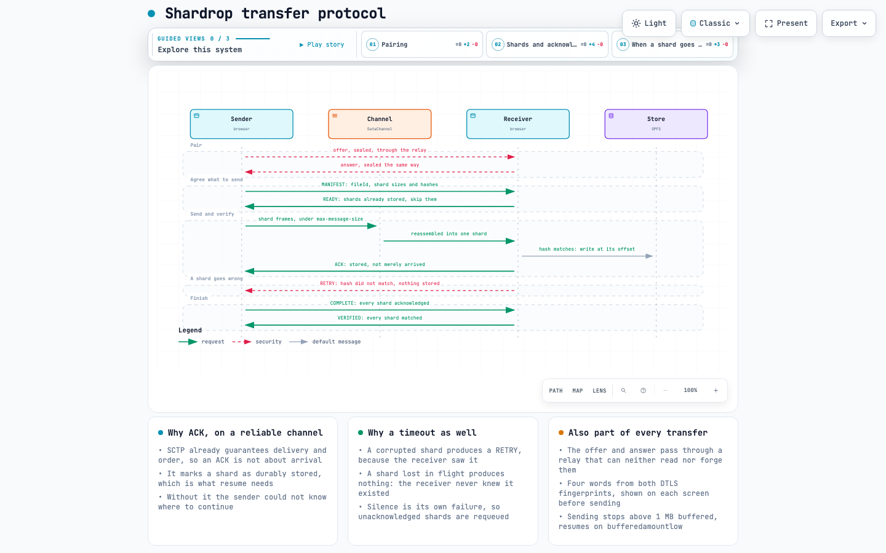

# Shardrop: a case study

Browser-to-browser file transfer with per-shard verification, backpressure and resume — built to learn distributed-systems engineering in the one environment that makes every constraint unavoidable.

- **Live:** [shardrop.vercel.app](https://shardrop.vercel.app)
- **Interactive architecture diagram:** [architecture.html](architecture.html)
- **Interactive protocol diagram:** [protocol-sequence.html](protocol-sequence.html)
- **Wire protocol:** [protocol.md](protocol.md) · **Decisions:** [decisions/](decisions/) · **Measurements:** [benchmarks.md](benchmarks.md)

---

## 1. The problem

Sending a large file to someone means uploading it to a server that keeps a copy, then having them download it. The file is at rest on infrastructure neither party controls, which is a privacy problem, a cost problem, and — for a 5 GB file on a hotel network — a patience problem.

WebRTC can move bytes directly between two browsers. The interesting question is not "can a browser open a peer connection" (it can, in about thirty lines) but everything that follows:

- A DataChannel message cannot exceed a size the connection negotiates — 256 KiB in Chromium. A 5 GB file must therefore be cut up, and the pieces tracked.
- A browser tab cannot hold 5 GB in memory.
- Networks drop. Tabs reload. A transfer that restarts from zero at 90% is useless.
- Two browsers on different networks cannot find each other unaided.
- Nothing about "direct" is self-evident: the user has to be told whether their file really went peer to peer.

## 2. Constraints, chosen deliberately

| Constraint                          | Consequence                                                                                            |
| ----------------------------------- | ------------------------------------------------------------------------------------------------------ |
| No server receives the file         | Transport is WebRTC DataChannel only; a relay may help two peers find each other, never carry the file |
| Flat memory, whatever the file size | `Blob.slice()` and lazy generators throughout; nothing calls `arrayBuffer()` on a whole file           |
| Integrity is checked, not assumed   | SHA-256 per shard, rehashed on arrival, before anything is stored                                      |
| Interruption is normal              | Shard state is persisted; a resumed transfer sends only what is missing                                |
| The user is told the truth          | Direct or relayed is displayed; a refused network says so instead of spinning                          |

## 3. Architecture


[architecture.html](architecture.html) is the interactive version, with guided views.

```text
Sending browser                                    Receiving browser
  file
   └─ chunk engine ── hash workers                   transfer engine ── shard store (OPFS)
        └─ manifest                                       │                    └─ saved file
             └─ transfer engine ──► DataChannel ──────────┘
                                    ▲        ▲
                       signaling relay   STUN / optional TURN
                       (sealed SDP)      (addresses / last resort)
```

Nine modules, each with one job, none touching the DOM:

| Module                         | Responsibility                                                       |
| ------------------------------ | -------------------------------------------------------------------- |
| `chunker.ts`                   | A file becomes a lazy sequence of shards (1–25 MB)                   |
| `hasher.ts` / `hash-worker.ts` | SHA-256, in a worker pool, falling back to this thread               |
| `manifest.ts`                  | What is being sent: `fileId`, path, per-shard sizes and hashes       |
| `frame.ts`                     | A shard becomes frames that fit under the negotiated message size    |
| `protocol.ts`                  | Control messages, validated on arrival because the wire is untrusted |
| `transfer.ts`                  | The state machine: backpressure, window, retry, verification         |
| `chunk-store.ts`               | OPFS storage at byte offsets, plus the resume state                  |
| `signaling.ts`                 | One pairing code → relay room id + AES-GCM key                       |
| `peer.ts`                      | `RTCPeerConnection`, the DataChannel, direct-vs-relayed reporting    |

The UI renders a `TransferProgress` snapshot and nothing else. Correctness never depends on a rendered state.



[protocol-sequence.html](protocol-sequence.html) walks the same protocol message by message.

## 4. Six decisions worth defending

Each has a full record in [decisions/](decisions/); these are the short versions.

### A logical shard is not a wire message

The SDP for a real connection advertises `a=max-message-size:262144`. Firefox advertises far more. So frame size is read from `pc.sctp.maxMessageSize` at runtime and capped, and a 1–25 MB shard is cut into frames underneath it. Two layers, two reasons: the shard is the unit of hashing, storage and resume; the frame is the unit the transport will accept.

### An ACK on a reliable channel is not about delivery

SCTP already guarantees delivery and ordering, and DTLS already encrypts. So the per-shard hash does not defend against network corruption, which cannot happen — it defends against bugs, storage faults and a hostile peer. Likewise `ACK` does not mean "arrived", it means **"hashed, and durably stored"**, which is the only fact resume can be built on.

That distinction has a sharp consequence. A corrupted shard produces a `RETRY`, because the receiver saw it. A shard lost in flight produces _nothing at all_ — the receiver never knew it existed. **Silence is therefore its own failure mode**, and unacknowledged shards are requeued on a timeout. This was not designed in; it was found by a test that dropped a shard and watched the sender wait forever ([§6](#6-five-bugs-and-what-found-them)).

### OPFS, not IndexedDB ([decision 002](decisions/002-opfs.md))

IndexedDB would store each shard as a record, and assembling the file would mean reading every record back — doubling storage or pushing the whole file through memory. The Origin Private File System takes a random-access write at a byte offset, so each shard goes straight to its place and finishing is `getFile()`. Resume becomes "which offsets are missing", persisted beside the data.

### The content id is a hash of the shard hashes ([decision 001](decisions/001-file-id.md))

`fileId` identifies content so that resume and deduplication work across sessions; `transferId` identifies one session. A streaming whole-file SHA-256 would need an extra dependency, because `crypto.subtle` cannot hash incrementally. Hashing the shard hashes costs one extra hash of a short string — and is the first step toward a Merkle root. The trade-off, documented rather than hidden: the id depends on the shard size, so shard size is part of the hashed input.

### One pairing code, two derived secrets ([decision 003](decisions/003-signaling.md))

Cross-network pairing needs a signaling relay, and a relay introduces a party that could rewrite the SDP — which carries the DTLS fingerprint that authenticates the "direct" connection. So one 80-bit code derives both the relay's room id and an AES-256-GCM key, through HKDF:

```text
code ──HKDF(info="room")────────► room id     → given to the relay
     └─HKDF(info="aes-gcm-key")─► AES-256-GCM → never leaves the browser
```

The relay sees an opaque room id and ciphertext it can neither read nor forge. The code travels in the URL fragment, which browsers never send to a server. What this does _not_ prove is who holds the code — so both screens also show four words derived from the two DTLS fingerprints, which match only if both browsers see the same pair of certificates.

### Folders are a loop, not a new format ([decision 004](decisions/004-batches.md))

Zipping a selection would compress before anything moves and hand the receiver an archive instead of their files. Interleaving files over one ordered stream costs bookkeeping and buys no throughput. So `MANIFEST` gained an optional batch position, and each file keeps its own manifest, hashes, store and resume state. A sender that never sets it behaves exactly as before.

## 5. Measurements, not assumptions

The original plan assumed hashing would need a Web Worker to keep the page responsive. Measured in Chromium on a 200 MB file ([benchmarks.md](benchmarks.md)):

| Shard size | Main thread | Worker    |
| ---------- | ----------- | --------- |
| 256 KB     | 702 MB/s    | 602 MB/s  |
| 1 MB       | 869 MB/s    | 872 MB/s  |
| 5 MB       | 1062 MB/s   | 1104 MB/s |

Hashing is **not** the bottleneck at 600–1100 MB/s; the DataChannel is. `crypto.subtle.digest` is genuinely asynchronous in Chromium and already does its work off the calling thread, which is why the columns match. One 50 MB digest is the exception: 66 ms of dropped frames on the main thread against 25 ms in a worker. The worker stays for that worst case and for engines whose `digest` is not off-thread — but not for the reason the plan assumed ([decision 005](decisions/005-hash-worker.md)).

**The measurement was wrong first.** The initial harness reported 0 ms of stall everywhere — including for a deliberately blocking 300 ms loop. A stall is only observable on the frame _after_ it, and the watcher stopped one frame too early. The control case is now part of the published output, so the numbers can be checked rather than believed.

## 6. Five bugs, and what found them

The interesting part of this project is not the design; it is which layer of testing caught what.

| Bug                                                               | Symptom                                       | Found by                                           |
| ----------------------------------------------------------------- | --------------------------------------------- | -------------------------------------------------- |
| Sender waited forever on a lost shard                             | Transfer hung at 90%                          | Unit test that drops a shard on a fake wire        |
| ACK arriving mid-send left a shard marked unacknowledged for good | Random failure after ~20 shards               | 30 MB transfer in a real browser                   |
| Concurrent OPFS writables clobbered each other                    | "chunk 22 never acknowledged" on larger files | 30 MB transfer in a real browser                   |
| A receiver-side failure was caught and dropped                    | Sender waited for ACKs that would never come  | Same run; the receiver had already failed silently |
| Storage sweep deleted a file the user could still download        | Download cancelled after a folder transfer    | End-to-end folder test                             |

Two deserve elaboration.

**Concurrent OPFS writes.** With eight shards in flight, the store opened several `createWritable()` streams on the same file handle. Each one starts from a snapshot of the file, so the last to close silently discarded the others' data — or threw. Writes are now serialised through a promise queue. No unit test could have found this: the in-memory store used by tests has no such semantics. It took a real browser and a file large enough to have eight shards in flight.

**The sweep versus the download.** Finished transfers were cleaned up as soon as the next file started. But the `File` handed to the page reads straight from the OPFS file, so deleting it invalidated a download the user had not clicked yet. Completed transfers are now kept for an hour. This is the kind of bug that only appears when two features meet.

## 7. Testing strategy

Three layers, each answering something the others cannot:

- **86 unit tests** — a fake wire connects two fake peers and can corrupt a byte, drop a shard, or feed hostile input (an index outside the manifest, a shard longer than promised, data before any manifest). The protocol is fully exercised without a browser, because happy-dom has no WebRTC.
- **6 Playwright tests** — two real browser contexts, real WebRTC, real OPFS. They pair both ways (shared link and typed code), transfer a file and a folder, and compare every downloaded file's SHA-256 against the source. Random bytes, not zeros: a file of zeros would pass even if shards landed at the wrong offsets.
- **One benchmark** — a Playwright test that measures throughput and main-thread stalls in a real browser and writes `benchmarks.md`, with a control case proving the instrument works.

## 8. What is deliberately not built

- **TURN is configurable but not deployed.** STUN alone connects most cross-network pairs; symmetric NAT, CGNAT and blocked UDP need a relay. Without one configured, those connections are **refused with an explanation** rather than silently relayed or left spinning.
- **No application-layer encryption over DTLS.** It would add work without adding safety while the signaling path is authenticated and no relay carries payload. It becomes worthwhile the day TURN is in use.
- **A thousand tiny files pay a manifest round trip each.** Grouping small files into one manifest is the obvious fix and is not done.
- **No mobile-browser testing.** The QR flow is designed for phones, and phones are where OPFS quotas and background throttling bite hardest.

## 9. What this exercise actually taught

Chunking was the starting curiosity. The lessons that stuck were about everything around it:

1. **A reliable transport changes what your protocol is for.** Half of the naive design — hashes against corruption, ACKs for delivery — solves problems SCTP already solved. The valuable half is about _durability_ and _resume_.
2. **Absence is a state.** The hardest bug was a message that was never sent, because the receiver never knew there was anything to report.
3. **Two correct features can be wrong together.** The sweep was right, the download was right, and the pair lost data.
4. **Measure the instrument before the subject.** A benchmark that reports zero for a 300 ms block is worse than no benchmark.
5. **"No server" is a claim with a shape.** It has to be stated precisely — no server receives the file — and the UI has to prove it per connection, not promise it in a README.
